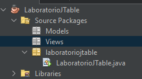
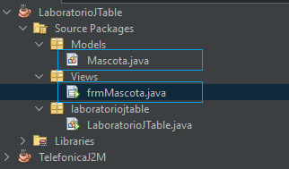
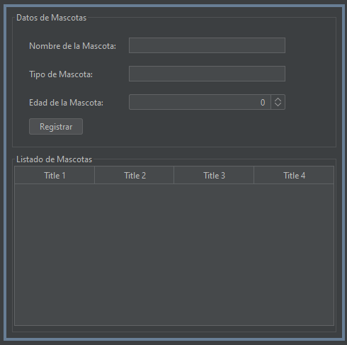

# Programación de Computadoras I

## Laboratorio Programado - JTable - NetBeans (Java)

### Objetivo

Entender el uso de JTable: Comprender cómo se crea y utiliza un componente JTable en una aplicación de Java NetBeans.

### Tema

La pequeña aplicación se creara se basa en la necesidad de registrar las mascotas y mostrarlas en un JTable.

## Creación del Proyecto y Diseño de la Interfaz Gráfica

### Creación del Proyecto

1. Abre NetBeans y selecciona "Nuevo Proyecto".
2. Elige  "Java With Ant" → "Aplicación Java" y haz clic en "Siguiente".
3. Ingresa el nombre del proyecto (por ejemplo, "LaboratorioJTable") y selecciona la ubicación. Haz clic en "Finalizar".
4. Se deberá agregar dos paquetes al proyecto uno para almacenar la clases de los modelos (Models) y el otro que almacenara los formularios o GUI de la aplicación (Views):
   


5. En el paquete de Models, se deberá crear una nueva clase con el nombre de mascotas y en el paquete Views sew deberá crear un nuevo JFrame Forms con el nombre frmMascotas:
   


### Modelo de la Clase Mascota

En este caso el código que se utilizara para la clase **Mascota.java** es el siguiente:

```java
package Models;

/**
 *
 * @author seth
 */
public class Mascota {
    private String nombre;
    private String tipo;
    private int edad;

    public Mascota(String nombre, String tipo, int edad) {
        this.nombre = nombre;
        this.tipo = tipo;
        this.edad = edad;
    }

    // Getters y setters

    public String getNombre() {
        return nombre;
    }

    public void setNombre(String nombre) {
        this.nombre = nombre;
    }

    public String getTipo() {
        return tipo;
    }

    public void setTipo(String tipo) {
        this.tipo = tipo;
    }

    public int getEdad() {
        return edad;
    }

    public void setEdad(int edad) {
        this.edad = edad;
    }
}
```

Es una clase sencilla, pero la utilizaremos para la creación de una lista de mascota.

### GUI de Mascotas

A continuación se muestra la interfaz gráfica de usuario



<table>
 <thead>
    <tr>
        <th>Control </th>
        <th>Propiedad </th>
        <th>Valor</th>
    </tr>
  </thead>
  <tbody>
    <td>JFrame</td>
    <td>title</td>
    <td>Registro de Mascotas</td>
  </tr>
  <tr>
    <td>JPanel</td>
    <td>border → titled border → title</td>
    <td>Datos de Mascotas</td>
  </tr>
  <tr>
    <td>JPanel</td>
    <td>border → titled border → title</td>
    <td>Lista de Mascotas</td>
  </tr>
  <tr>
    <td>JLabel</td>
    <td>text</td>
    <td>Nombre de la Mascota</td>
  </tr>

  <tr>
    <td rowspan=2>Text Field</td>
    <td>text</td>
    <td>"  " 👉🏻 Vació</td>
  </tr>
  <tr>
    <td>Variable Name</td>
    <td>txtNombreMascota</td>
  </tr>

  <tr>
    <td>JLabel</td>
    <td>text</td>
    <td>Tipo de Mascota:</td>
  </tr>
  <tr>
    <td rowspan=2>Text Field</td>
    <td>text</td>
    <td>"  " 👉🏻 Vació</td>
  </tr>
  <tr>
    <td>Variable Name</td>
    <td>txtTipoMascota</td>
  </tr>

  <tr>
    <td>JLabel</td>
    <td>text</td>
    <td>Edad de la Mascota:</td>
  </tr>
    <tr>
    <td>Spinner</td>
    <td>Variable Name</td>
    <td>spnEdadMascota</td>
  </tr> 
  <tr>
    <td rowspan=2>Button</td>
    <td>text</td>
    <td>Registrar</td>
  </tr>
  <tr>
    <td>Variable Name</td>
    <td>btnRegistrar</td>
  </tr>
  <tr>
    <td>JTable</td>
    <td>Variable Name</td>
    <td>tblListadoMascotas</td>
  </tr>
  </tbody>
</table>

!!! Importante 
    Se debe de considerar eliminar el bloque de arranque del JFrame, para que la aplicación solo tenga un punto de iniciación.
    Para ello elimine el método *public static void main(String args[]) { .. }* del **JFrame**

En este punto se deberá de importar algunos librerías a como se muestra en el código siguiente:
```java
import Models.Mascota;
import java.util.ArrayList;
import javax.swing.table.DefaultTableModel;
```
Luego a nivel de clase se deberán crear los siguientes atributos o variables:
```java
  private ArrayList<Mascota> mascotasList;
```
!!! note
    Un ArrayList en Java es una estructura de datos que permite almacenar y manipular elementos de manera dinámica

    Declaración e inicialización:
    ```java
      // Declaración e inicialización de un ArrayList de enteros
      ArrayList<Integer> numeros = new ArrayList<>();
    ```

    Agregar Elementos:
    ```java
      numeros.add(5);
      numeros.add(10);
    
    ```
    Acceder a Elementos:
    ```java
      int primerNumero = numeros.get(0);
    ```
    Eliminar Elementos:
    ```java
      numeros.remove(0); // Elimina el elemento en el índice 0
    ```
    Recorrer el ArrayList:

    ```java
        for (int i = 0; i < numeros.size(); i++) {
          System.out.println(numeros.get(i));
        }
    ```

En este punto deberemos inicializar el ArrayList colocando el código en el constructor de la clase:

```java
public frmMascota() {
    initComponents();
    //Se inicializa la lista de mascotas 
    mascotasList = new ArrayList<>();
}
```
Luego se deberá crear un método con el nombre *CargarDatosTable* el cual se encargara de crear el modelo de la tabla y de recorrer el ArrayList de las mascotas para ir sacando cada elemento de este e insertándolo en el modelo de la tabla

```java
 private void CargarDatosTable() {

        //Creación del modelo de la tabla
        DefaultTableModel modeloTabla = new DefaultTableModel();
        //Se define las columnas del modelo
        modeloTabla.addColumn("Nombre Mascota");
        modeloTabla.addColumn("Tipo Mascota");
        modeloTabla.addColumn("Edad Mascota");

        for (Mascota mascota : mascotasList) {
            modeloTabla.addRow(new Object[]{mascota.getNombre(), mascota.getTipo(), mascota.getEdad()});
        }

        tblListadoMascotas.setModel(modeloTabla);
    }
```

Por ultimo en el evento ActionPerformed del botón Registrar deberemos crear el siguiente código:

```java
 private void btnRegistrarActionPerformed(java.awt.event.ActionEvent evt) {                                             
        // Obtener datos de la mascota desde el usuario (puedes usar JOptionPane o JTextField)

        String nombre = txtNombreMascota.getText();
        String tipo = txtTipoMascota.getText();
        int edad = (int) spnEdadMascota.getValue();

        // Crear un objeto Mascota
        Mascota nuevaMascota = new Mascota(nombre, tipo, edad);

        // Agregar la mascota a la lista y a la tabla
        mascotasList.add(nuevaMascota);
        CargarDatosTable();
}    
```
!!! tip el código Completo de JFrame es el siguiente: 
    ```java 

    package Views;

    import Models.Mascota;
    import java.util.ArrayList;
    import javax.swing.table.DefaultTableModel;

    /**
    *
    * @author seth
    */
    public class frmMascota extends javax.swing.JFrame {

      
        private ArrayList<Mascota> mascotasList;

        /**
        * Creates new form frmMascota
        */
        public frmMascota() {
            initComponents();
            //Se inicializa la lista de mascotas 
            mascotasList = new ArrayList<>();
        }

        /**
        * This method is called from within the constructor to initialize the form.
        * WARNING: Do NOT modify this code. The content of this method is always
        * regenerated by the Form Editor.
        */
        @SuppressWarnings("unchecked")
        // <editor-fold defaultstate="collapsed" desc="Generated Code">                          
        private void initComponents() {

            jPanel1 = new javax.swing.JPanel();
            jLabel1 = new javax.swing.JLabel();
            jLabel2 = new javax.swing.JLabel();
            jLabel3 = new javax.swing.JLabel();
            txtNombreMascota = new javax.swing.JTextField();
            txtTipoMascota = new javax.swing.JTextField();
            spnEdadMascota = new javax.swing.JSpinner();
            btnRegistrar = new javax.swing.JButton();
            jPanel2 = new javax.swing.JPanel();
            jScrollPane1 = new javax.swing.JScrollPane();
            tblListadoMascotas = new javax.swing.JTable();

            setDefaultCloseOperation(javax.swing.WindowConstants.EXIT_ON_CLOSE);

            jPanel1.setBorder(javax.swing.BorderFactory.createTitledBorder("Datos de Mascotas"));

            jLabel1.setText("Nombre de la Mascota:");

            jLabel2.setText("Tipo de Mascota:");

            jLabel3.setText("Edad de la Mascota:");

            btnRegistrar.setText("Registrar");
            btnRegistrar.addActionListener(new java.awt.event.ActionListener() {
                public void actionPerformed(java.awt.event.ActionEvent evt) {
                    btnRegistrarActionPerformed(evt);
                }
            });

            javax.swing.GroupLayout jPanel1Layout = new javax.swing.GroupLayout(jPanel1);
            jPanel1.setLayout(jPanel1Layout);
            jPanel1Layout.setHorizontalGroup(
                jPanel1Layout.createParallelGroup(javax.swing.GroupLayout.Alignment.LEADING)
                .addGroup(jPanel1Layout.createSequentialGroup()
                    .addGap(21, 21, 21)
                    .addGroup(jPanel1Layout.createParallelGroup(javax.swing.GroupLayout.Alignment.LEADING)
                        .addComponent(btnRegistrar)
                        .addGroup(jPanel1Layout.createSequentialGroup()
                            .addGroup(jPanel1Layout.createParallelGroup(javax.swing.GroupLayout.Alignment.LEADING)
                                .addComponent(jLabel1)
                                .addComponent(jLabel2)
                                .addComponent(jLabel3))
                            .addGap(18, 18, 18)
                            .addGroup(jPanel1Layout.createParallelGroup(javax.swing.GroupLayout.Alignment.LEADING, false)
                                .addComponent(txtNombreMascota)
                                .addComponent(txtTipoMascota, javax.swing.GroupLayout.DEFAULT_SIZE, 221, Short.MAX_VALUE)
                                .addComponent(spnEdadMascota))))
                    .addContainerGap(javax.swing.GroupLayout.DEFAULT_SIZE, Short.MAX_VALUE))
            );
            jPanel1Layout.setVerticalGroup(
                jPanel1Layout.createParallelGroup(javax.swing.GroupLayout.Alignment.LEADING)
                .addGroup(jPanel1Layout.createSequentialGroup()
                    .addGap(19, 19, 19)
                    .addGroup(jPanel1Layout.createParallelGroup(javax.swing.GroupLayout.Alignment.BASELINE)
                        .addComponent(jLabel1)
                        .addComponent(txtNombreMascota, javax.swing.GroupLayout.PREFERRED_SIZE, javax.swing.GroupLayout.DEFAULT_SIZE, javax.swing.GroupLayout.PREFERRED_SIZE))
                    .addGap(18, 18, 18)
                    .addGroup(jPanel1Layout.createParallelGroup(javax.swing.GroupLayout.Alignment.BASELINE)
                        .addComponent(jLabel2)
                        .addComponent(txtTipoMascota, javax.swing.GroupLayout.PREFERRED_SIZE, javax.swing.GroupLayout.DEFAULT_SIZE, javax.swing.GroupLayout.PREFERRED_SIZE))
                    .addGap(18, 18, 18)
                    .addGroup(jPanel1Layout.createParallelGroup(javax.swing.GroupLayout.Alignment.BASELINE)
                        .addComponent(jLabel3)
                        .addComponent(spnEdadMascota, javax.swing.GroupLayout.PREFERRED_SIZE, javax.swing.GroupLayout.DEFAULT_SIZE, javax.swing.GroupLayout.PREFERRED_SIZE))
                    .addPreferredGap(javax.swing.LayoutStyle.ComponentPlacement.UNRELATED)
                    .addComponent(btnRegistrar)
                    .addContainerGap(15, Short.MAX_VALUE))
            );

            jPanel2.setBorder(javax.swing.BorderFactory.createTitledBorder("Listado de Mascotas"));

            tblListadoMascotas.setModel(new javax.swing.table.DefaultTableModel(
                new Object [][] {
                    {null, null, null, null},
                    {null, null, null, null},
                    {null, null, null, null},
                    {null, null, null, null}
                },
                new String [] {
                    "Title 1", "Title 2", "Title 3", "Title 4"
                }
            ));
            jScrollPane1.setViewportView(tblListadoMascotas);

            javax.swing.GroupLayout jPanel2Layout = new javax.swing.GroupLayout(jPanel2);
            jPanel2.setLayout(jPanel2Layout);
            jPanel2Layout.setHorizontalGroup(
                jPanel2Layout.createParallelGroup(javax.swing.GroupLayout.Alignment.LEADING)
                .addGroup(jPanel2Layout.createSequentialGroup()
                    .addComponent(jScrollPane1, javax.swing.GroupLayout.PREFERRED_SIZE, javax.swing.GroupLayout.DEFAULT_SIZE, javax.swing.GroupLayout.PREFERRED_SIZE)
                    .addGap(0, 0, Short.MAX_VALUE))
            );
            jPanel2Layout.setVerticalGroup(
                jPanel2Layout.createParallelGroup(javax.swing.GroupLayout.Alignment.LEADING)
                .addGroup(jPanel2Layout.createSequentialGroup()
                    .addComponent(jScrollPane1, javax.swing.GroupLayout.PREFERRED_SIZE, 226, javax.swing.GroupLayout.PREFERRED_SIZE)
                    .addContainerGap(javax.swing.GroupLayout.DEFAULT_SIZE, Short.MAX_VALUE))
            );

            javax.swing.GroupLayout layout = new javax.swing.GroupLayout(getContentPane());
            getContentPane().setLayout(layout);
            layout.setHorizontalGroup(
                layout.createParallelGroup(javax.swing.GroupLayout.Alignment.LEADING)
                .addGroup(layout.createSequentialGroup()
                    .addContainerGap()
                    .addGroup(layout.createParallelGroup(javax.swing.GroupLayout.Alignment.TRAILING, false)
                        .addComponent(jPanel2, javax.swing.GroupLayout.DEFAULT_SIZE, javax.swing.GroupLayout.DEFAULT_SIZE, Short.MAX_VALUE)
                        .addComponent(jPanel1, javax.swing.GroupLayout.DEFAULT_SIZE, javax.swing.GroupLayout.DEFAULT_SIZE, Short.MAX_VALUE))
                    .addContainerGap(javax.swing.GroupLayout.DEFAULT_SIZE, Short.MAX_VALUE))
            );
            layout.setVerticalGroup(
                layout.createParallelGroup(javax.swing.GroupLayout.Alignment.LEADING)
                .addGroup(layout.createSequentialGroup()
                    .addContainerGap()
                    .addComponent(jPanel1, javax.swing.GroupLayout.PREFERRED_SIZE, javax.swing.GroupLayout.DEFAULT_SIZE, javax.swing.GroupLayout.PREFERRED_SIZE)
                    .addPreferredGap(javax.swing.LayoutStyle.ComponentPlacement.RELATED)
                    .addComponent(jPanel2, javax.swing.GroupLayout.DEFAULT_SIZE, javax.swing.GroupLayout.DEFAULT_SIZE, Short.MAX_VALUE)
                    .addContainerGap())
            );

            pack();
        }// </editor-fold>                        

        private void btnRegistrarActionPerformed(java.awt.event.ActionEvent evt) {                                             
            // Obtener datos de la mascota desde el usuario (puedes usar JOptionPane o JTextField)

            String nombre = txtNombreMascota.getText();
            String tipo = txtTipoMascota.getText();
            int edad = (int) spnEdadMascota.getValue();

            // Crear un objeto Mascota
            Mascota nuevaMascota = new Mascota(nombre, tipo, edad);

            // Agregar la mascota a la lista y a la tabla
            mascotasList.add(nuevaMascota);
            CargarDatosTable();
        }                                            

        private void CargarDatosTable() {

            //Creación del modelo de la tabla
            DefaultTableModel modeloTabla = new DefaultTableModel();
            //Se define las columnas del modelo
            modeloTabla.addColumn("Nombre Mascota");
            modeloTabla.addColumn("Tipo Mascota");
            modeloTabla.addColumn("Edad Mascota");

            for (Mascota mascota : mascotasList) {
                modeloTabla.addRow(new Object[]{mascota.getNombre(), mascota.getTipo(), mascota.getEdad()});
            }

            tblListadoMascotas.setModel(modeloTabla);
        }


        // Variables declaration - do not modify                     
        private javax.swing.JButton btnRegistrar;
        private javax.swing.JLabel jLabel1;
        private javax.swing.JLabel jLabel2;
        private javax.swing.JLabel jLabel3;
        private javax.swing.JPanel jPanel1;
        private javax.swing.JPanel jPanel2;
        private javax.swing.JScrollPane jScrollPane1;
        private javax.swing.JSpinner spnEdadMascota;
        private javax.swing.JTable tblListadoMascotas;
        private javax.swing.JTextField txtNombreMascota;
        private javax.swing.JTextField txtTipoMascota;
        // End of variables declaration                   
    }

    
    ```
    


Por ultimo en la clase principal en el método **main** se realiza el código para iniciar el formulario:

```java
  public static void main(String[] args) {
       frmMascota frm = new frmMascota();
       frm.setVisible(true);
    }
```